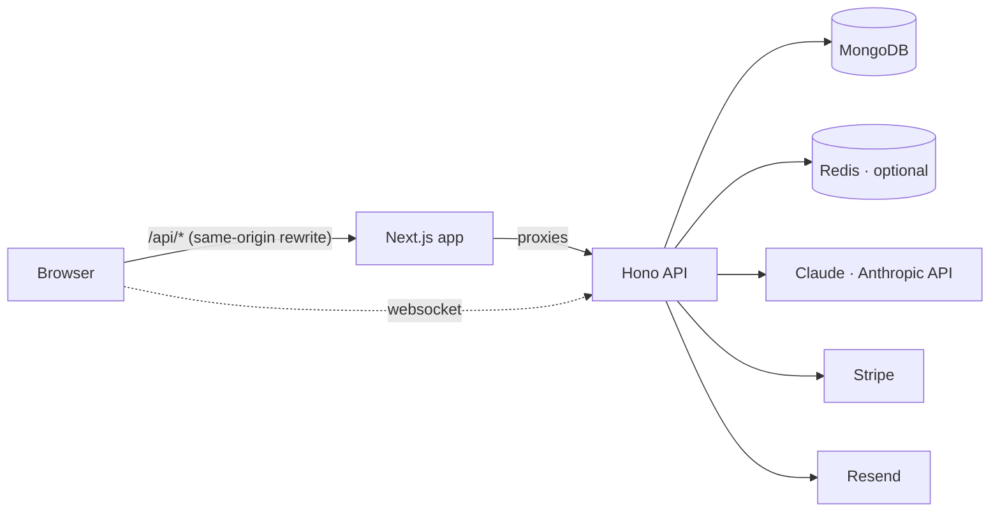

<p align="center">
  
</p>
<h1 align="center">only pain</h1>
<p align="center"><em>It's okay to not be okay here.</em></p>
<p align="center">
  A quiet corner of the internet for the heavy stuff — anxiety, burnout, grief, the 3am thoughts.<br/>
  Post anonymously. Find people who actually get it. Talk to <strong>Ember</strong> when nobody else is awake.
</p>

<p align="center"><strong>Live:</strong> <a href="https://onlypain.vercel.app">onlypain.vercel.app</a> · API: <a href="https://onlypain-api.onrender.com/api/health">onlypain-api.onrender.com</a></p>

<p align="center">
  <a href="#features">Features</a> · <a href="#architecture">Architecture</a> · <a href="#safety-design">Safety</a> · <a href="#local-development">Run locally</a> · <a href="DEPLOYMENT.md">Deploy</a>
</p>

---

The name is a joke. The place isn't. **only pain** is a peer-support social network built around one idea: people in pain need to feel heard before they need to be fixed. Everything — the anonymous-by-default posting, the five reactions, the topic "circles", the request-gated DMs, the AI companion — is designed for honesty without harm.

## Features

**Community**
- **Anonymous-by-default posting.** One switch turns a post into just words. The author link is stripped at the service layer and never reaches any screen — feeds, profiles, notifications, or the moderation queue. Only the author sees their own anonymous history.
- **Reactions that mean something.** 🤍 heart · 🫠 *I feel this* · 🫂 *you're not alone* · 🔥 *sending strength* · 🧸 *hug*. Counted, never ranked.
- **Circles.** Small rooms for specific kinds of heavy (3am club, the grief kitchen, burnout ward, adhd brains…). Members-only posting, open reading, community-created circles with owners.
- **People who get it.** Explainable matching on shared struggles and circles — the UI shows *why* someone is suggested.
- **Three feeds.** *For you* (ranked by overlap with what you carry, warmth and freshness), *Latest*, *Following* (which can never leak anonymous posts).
- **Request-gated direct messages** with real-time delivery, typing indicators and read receipts (Socket.io). Privacy: anyone / only people I follow / nobody.
- Threaded comments (two levels), bookmarks, content notes with tap-to-reveal veils, blocks, reports, notifications (live + persisted).

**AI — Ember (Claude)**
- **Ember, the companion.** A streaming chat (SSE) with a carefully written persona: listens first, no toxic positivity, tiny concrete tools, hard clinical boundaries, and helplines offered naturally when risk appears. Conversations are private and deletable.
- **Safety pass on every post, comment and DM.** A classifier scores *author risk* (none → high) and *harm to readers* separately. High risk quietly surfaces resources to the author (max once/day); harmful content is hidden pending human review. Venting and dark humour stay up.
- **Untangle.** CBT-informed reframing: validation → thinking patterns → a kinder, truer version → one tiny step. Saved privately.
- **"Not sure what to say?"** Three compassionate reply starters for someone else's hard post.
- **Weekly reflection** (Plus). Ember reads the week's mood check-ins and posts and writes back what it noticed.
- Works without an API key too: a mock provider keeps every feature demoable, and keyword pre-screening keeps the safety net up.

**Wellbeing tools**
- Daily mood check-in with feelings + note, streaks, a 30-day chart (with table view) and an opt-in 7-day "mood ring" on your profile.
- Guided breathing (calm / 4·7·8 / box) with a living, breathing UI.
- Crisis resources everywhere they're needed: in the composer as you type, after a risky post, inside Ember, and on a dedicated page.

**Product & platform**
- **Plus** subscription via Stripe (Checkout + Customer Portal + webhooks) with per-feature daily quotas by plan.
- Email verification + password reset (Resend, console transport in dev), multi-device sessions with revoke / log-out-everywhere, refresh-token rotation with reuse detection, data export, account deletion.
- Moderator dashboard: AI + user reports, risk-first queue, hide/restore/remove/ban with audit trail.
- Rate limiting (Redis or in-memory), secure headers, cursor pagination everywhere, structured logging, health endpoint, Docker images, CI.

## Architecture

```
frontend/  Next.js 16 · React 19 · Tailwind 4 · TanStack Query · motion · Radix · Socket.io client
backend/   Hono · Prisma 6 (MongoDB replica set) · Socket.io · jose · Zod · Anthropic SDK · Stripe · Resend · ioredis · Vitest
```



- **Same-origin API.** The web app rewrites `/api/*` to the API, so auth cookies (`httpOnly`, `SameSite=Lax`) stay first-party and there is no CORS in production. Sockets connect directly with a short-lived token.
- **Layered API.** `routes → services → Prisma`, with Zod validation at the edge and a typed error envelope (`{ success, data | error, code }`). Every list is cursor-paginated (`nextCursor`, `hasMore`).
- **Safety invariant.** `backend/src/lib/anonymize.ts` is the only way posts/comments leave the service layer. Tests assert the author id never appears in any response for anonymous content.
- **Background moderation.** Posting is never blocked; the classifier runs after the response and updates risk, content notes, visibility and the mod queue.
- **Streaming.** Ember replies stream over Server-Sent Events (`meta → delta* → done`), persisted when complete.

<details>
<summary>API surface</summary>

`/api/auth` signup · login · refresh · logout · logout-all · me · verify-email · forgot/reset-password · socket-token · sessions
`/api/feed?tab=foryou|latest|following` · `/api/posts` CRUD · `/:id/react` · `/:id/bookmark` · `/:id/comments` · `/:id/reply-ideas`
`/api/explore` search · tags · tags/trending · tags/:tag/posts · people · circles/suggested · pulse
`/api/users` profile · posts · followers/following · follow · block · me/anonymous-posts · me/bookmarks · me/blocked · me/export
`/api/settings` profile · onboarding · username · email · password · account
`/api/circles` list · create · :slug · join · leave · members · posts
`/api/dm` conversations · requests · messages · accept/decline · read · unread
`/api/notifications` · `/api/mood` · `/api/companion` (SSE) · `/api/tools` reframe/reflection/status · `/api/reports` · `/api/mod` · `/api/billing` · `/api/health`
</details>

## Safety design

Mental-health spaces fail in two ways: policing pain, or letting it fester into harm. The design tries to do neither.

| Moment | What happens |
|---|---|
| Crisis language while typing | Helplines appear inline in the composer. Nothing is blocked. |
| Post/comment matches crisis keywords | Immediate `safety.showResources` in the response → gentle dialog after posting. |
| AI classifier: author risk **HIGH** | A private "we're here" notification with resources (max once per 24h); an AI report enters the mod queue at the top. |
| AI classifier: **harmful** to readers | Content hidden (`moderation=HIDDEN`) pending a human; the author still sees it with a notice. |
| Ember hears risk | Persona instructions: slow down, ask about safety, offer a helpline as a hand — never a disclaimer. Resources card renders in the chat. |
| Someone reports "I'm worried about this person" | Jumps the queue (risk-first ordering). |

Model choice: `claude-opus-5` for Ember and the tools (quality matters), `claude-haiku-4-5` for the high-volume safety classifier. Both are env-configurable. Prompts live in `backend/src/ai/prompts.ts` and are stable so they prompt-cache.

## Local development

Prerequisites: Node 22+, MongoDB 7/8 (`mongod` + `mongosh` on PATH). Redis is optional.

```bash
npm install
npm run dev:db            # starts a single-node replica set on :27018 (Prisma needs a replica set)
cp backend/.env.example backend/.env   # fill JWT secrets (any 32+ random chars); leave AI/Stripe empty for mock mode
cp frontend/.env.example frontend/.env.local
npm run db:push           # sync schema + indexes
npm run db:seed           # demo community (login: demo / password123)
npm run dev               # api on :4000, web on :3000
```

Or the whole stack in containers: `docker compose up --build` (then `docker compose exec api npm run db:seed`).

Useful scripts: `npm test` (API integration tests against a real replica set — 30 tests covering auth, the anonymity invariant, feeds, reactions, comments, circles, DMs, mood, quotas), `npm run typecheck`, `npm run lint`, `npm run build`.

## Configuration

| Variable | Where | Purpose |
|---|---|---|
| `DATABASE_URL` | api | MongoDB connection string (**replica set required**) |
| `JWT_SECRET`, `JWT_REFRESH_SECRET` | api | 32+ random chars each |
| `CLIENT_URL` | api | Web origin (CORS for sockets, links in emails) |
| `ANTHROPIC_API_KEY` | api | Enables live Ember + AI safety. Empty → mock provider |
| `AI_MODEL_COMPANION`, `AI_MODEL_CLASSIFIER`, `AI_SAFETY_MODE` | api | Defaults `claude-opus-5`, `claude-haiku-4-5`, `full` |
| `REDIS_URL` | api | Shared rate limits + Socket.io adapter for multi-instance |
| `RESEND_API_KEY`, `EMAIL_FROM` | api | Transactional email (console transport when empty) |
| `STRIPE_SECRET_KEY`, `STRIPE_WEBHOOK_SECRET`, `STRIPE_PRICE_PLUS_MONTHLY` | api | Plus billing (UI degrades gracefully when empty) |
| `ADMIN_EMAILS` | api | Comma-separated emails that sign up as ADMIN |
| `BACKEND_URL` | web (server) | Where `/api/*` is proxied |
| `NEXT_PUBLIC_SOCKET_URL`, `NEXT_PUBLIC_APP_URL` | web (browser) | Socket origin, canonical URL |

## Deployment

See **[DEPLOYMENT.md](DEPLOYMENT.md)** — Vercel (web) + Railway/Render (api) + MongoDB Atlas + Upstash + Resend + Stripe + Anthropic, with a post-deploy checklist. `render.yaml` and both Dockerfiles are included; CI runs typecheck, lint, tests (against a real Mongo replica set) and builds the API image.

## Business model

Free forever for the social core and a daily allowance of Ember. **Plus** (₹199/month) removes the Ember limit, adds the weekly reflection and larger tool quotas, and pays for the free tier. Nobody who needs more support and can't pay is turned away — that's a product rule, not a marketing line.

## Roadmap ideas

Push notifications · image posts (Cloudinary is already whitelisted) · circle moderators & pinned posts · group check-in threads · localisation (Hindi first) · Razorpay for INR · body-doubling rooms · export to therapist summary.

---

Built by [@muskangyanani](https://github.com/muskangyanani). only pain is peer support, not a medical service. If you're in crisis in India, call **14416** (Tele-MANAS).
